## Overview

**uEmu** is a tiny cute emulator plugin for IDA based on unicorn engine.

Supports following architectures out of the box: **x86**, **x64**, **ARM**, **ARM64**

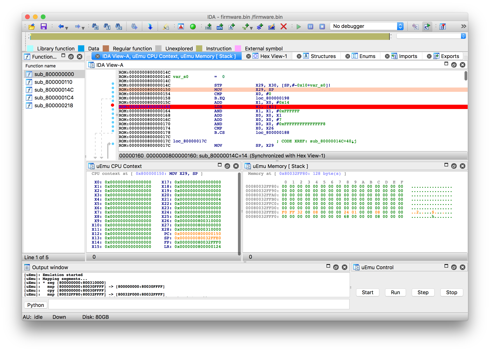

### What is it GOOD for?

- Emulate bare metal code (bootloaders, embedded firmware etc)
- Emulate standalone functions

### What is it BAD for?

- Emulate complex OS code (dynamic libraries, processes etc)
- Emulate code with many syscalls

### What can be improved?

- Find a way to emulate vendor specific register access (like `MSR S3_x, X0` for ARM64)
- Add more registers to track

## Installation

- `brew install unicorn` to install Unicorn binaries
- `pip install unicorn` to install Unicorn python bindings
- Use `File / Script file...` or `ALT+F7` in IDA to load **uEmu.py**

## Features

### Popup Menu

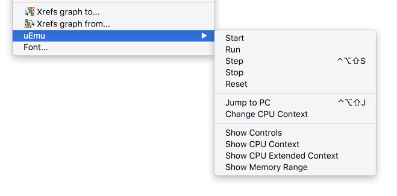

- **Start** command initializes emulator by mapping all segments and setting up Unicorn
- **Run** command emulates instructions until breakpoint is reached or error occurs
- **Step** emulates one or N instruction (hold `ALT`/`OPTION` to specify a number)
- **Stop** interrupts emulation
- **Reset** resets emulation engine and unmaps all memory regions
- **Jump To PC** simply jumps to current PC
- It is possible to **Update CPU Context** manually or via JSON file (see below)
- **Show Controls** displays window with Start/Run/Step/Stop buttons
- **Show CPU Context** displays window with available registers
- **Show Memory Range** allows to display specific memory region

### Start

Start emulation from cursor. It is necessary to provide initial CPU context first (see _Update CPU Context_)
After that all segments from IDA database will be mapped to emulator (initialized data will be copied as well).

### Run

Execute code until code or memory breakpoint is reached or there is an event which requires user action.

### Step

Perform a single step execution. Hold `ALT`/`OPTION` to specify number of steps to perform.

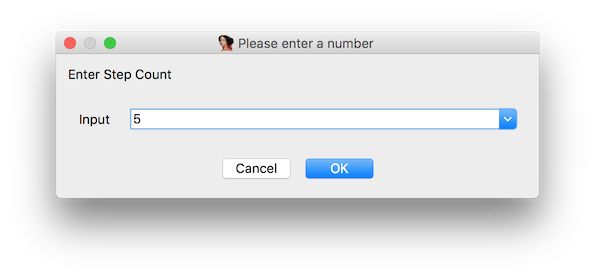

### Stop

When emulation is in progress this command can be used to interrupt execution.

### Reset

Resets emulator instance and unmaps all memory regions.

### Breakpoints

You can use IDA breakpoints to indicate locations where emulation should be interrupted. 
This includes code and memory breakpoints.
Usually used together with **Run** command.

### Runtime actions

#### Unmapped memory

When emulator needs to access memory which is not yet mapped, plugin will show a following dialog.

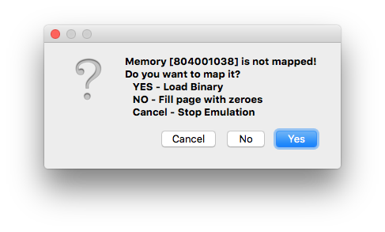

- Press **YES** to provide memory dump to be loaded to memory.

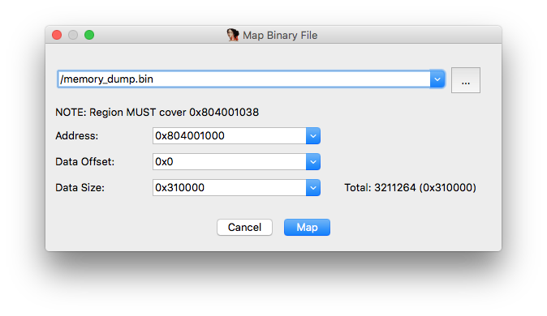

- Press **NO** to map one empty page (0x1000) filled with zeroes
- Press **Cancel** to stop emulation

#### Unknown instructions

When emulator runs into unknown instruction it is possible to skip it and restore CPU context manually.

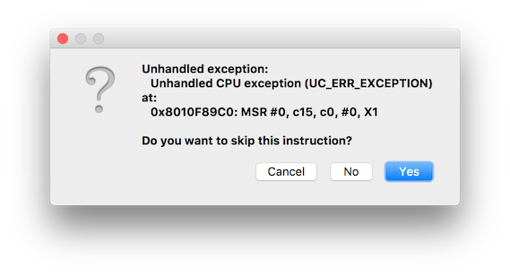

### Views

#### Controls

Just a panel to control execution.

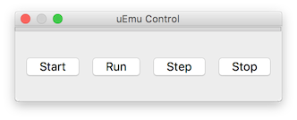

#### CPU Context

Current CPU context.

Every time emulation stops, changed registers will be highlighted. Registers can be displayed in 1, 2 or 3 columns via popup menu.

It is possible to update CPU context via popup menu (see below).

#### Memory

Use this view to observe memory regions for specified address and size. Comment will be displayed in a title for convenience.

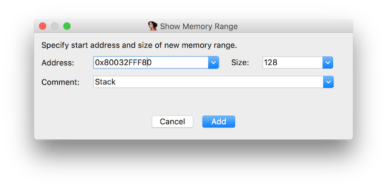

Every time emulation stops, changed memory blocks will be highlighted.

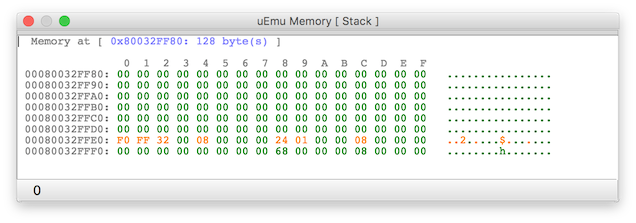

### Update CPU Context

Register Values can be changed individually or all at once with JSON file via popup menu.
Current context can also be saved in JSON file for future use.

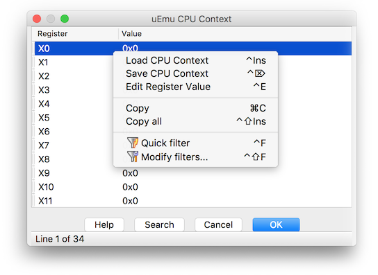

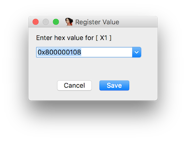

### Main Plugin Menu

Apart from all the functions listed in Popup Menu, there are couple of new commands.

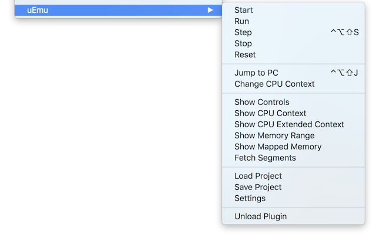

#### Show Mapped Memory

Display all mapped regions. Use popup menu to display memory for particular region or dump it to a file.

#### Fetch Segments

This command tries to sync IDA segments with mapped memory by creating new mappings or merging with existing ones if possible.
This helps to add new IDA segments to emulator in runtime without restarting emulator.

#### Load Project

Load uEmu state from file.

#### Save Project

Save uEmu state to file.
Please note that only registers defined in a plugin are saved.

#### Settings

- **Follow PC** scrolls IDA View to current PC during emulation
- **Convert to Code automatically** is IDA data under cursor is not code
- **Trace instructions** prints every instruction emulator is executing

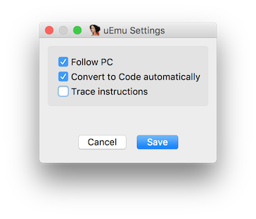

